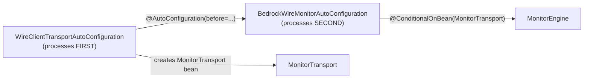

# Architecture guide

Deep technical reference for maintainers and contributors. For usage documentation, see [README.md](README.md).

---

## Table of contents

1. [Design principles](#design-principles)
2. [Package structure](#package-structure)
3. [Class dependency graph](#class-dependency-graph)
4. [Key concepts](#key-concepts)
5. [Spring auto-configuration](#spring-auto-configuration)
6. [Configuration flow](#configuration-flow)
7. [Execution model](#execution-model)
8. [Transport SPI contract](#transport-spi-contract)
9. [Validation pipeline](#validation-pipeline)
10. [Lifecycle and shutdown](#lifecycle-and-shutdown)
11. [Design decisions and rationale](#design-decisions-and-rationale)
12. [Example wiring](#example-wiring)

---

## Design principles

**Transport-agnostic.**
The monitor layer has zero knowledge of any HTTP client library.
All HTTP communication passes through the `MonitorTransport` SPI. The default implementation (`WireClientTransport`) is
an optional dependency.

**SPI boundary enforcement.**
Monitor-owned code (scheduling, retry, validation, status mapping) lives above the SPI line.
Transport-owned code (connection pools, TLS, timeouts, exception handling) lives below. No logic crosses the boundary.

**Fail-fast configuration.**
All validation happens at startup: unknown validator aliases, missing services, malformed durations, duplicate names.
The monitor refuses to start with an invalid config rather than failing silently at runtime.

**Virtual threads for concurrency.**
Each check run executes on a Java 21 virtual thread. The scheduler is a single platform thread that only fires triggers.
Retry delays use `Thread.sleep()` which releases the carrier thread.

**Shared infrastructure.**
When used alongside `bedrock-wire-client`, the monitor shares the same `HttpClientRegistry` bean.
Connection pools, TLS contexts, and registry capacity are shared between direct application usage and monitor checks.

---

## Package structure

```
cz.syntea.bedrock.wire.monitor/
├── spi/           Transport SPI — interfaces and value objects for the HTTP boundary
├── model/         Domain enums and DTOs — no business logic, no dependencies
├── config/        Configuration model and properties file parser
├── validation/    Validator interface, built-in implementations, registry
├── engine/        Core orchestration — scheduler, check runner, template processor
├── listener/      Output interface for check results
├── transport/     Default WireClientTransport (optional dependency on wire-client)
└── spring/        Spring Boot auto-configuration and properties
```

Each package has a single responsibility and a clear dependency direction.
The dependency flow is strictly top-down: `spring → engine → {config, validation, spi, listener} → model`.
The `transport` package depends on `spi` + `config` + the external `bedrock-wire-client`.

---

## Class dependency graph

### Full module dependency map

```mermaid
graph TD
    subgraph spring["spring (auto-configuration)"]
        BWMAC[BedrockWireMonitorAutoConfiguration]
        WCTAC[WireClientTransportAutoConfiguration]
        BWMP[BedrockWireMonitorProperties]
    end

    subgraph engine["engine (core)"]
        ME[MonitorEngine<br/><i>SmartLifecycle</i>]
        CR[CheckRunner]
        TP[TemplateProcessor]
    end

    subgraph config["config (model + provider)"]
        MCP[MonitorConfigProvider]
        PFCP[PropertiesFileConfigProvider]
        CC[CheckConfig]
        SC[ServiceConfig]
        TPC[TlsProfileConfig]
    end

    subgraph validation["validation"]
        VR[ValidatorRegistry]
        V[Validator<br/><i>interface</i>]
        HSV[HttpStatusValidator]
        CV[ContainsValidator]
        RV[RegexValidator]
        MDV[MaxDurationValidator]
        XPV[XPathValidator]
    end

    subgraph spi["spi (transport boundary)"]
        MT[MonitorTransport<br/><i>interface</i>]
        MReq[MonitorRequest]
        MRes[MonitorResult]
        TS[TransportStatus]
    end

    subgraph transport["transport (default impl)"]
        WCT[WireClientTransport]
    end

    subgraph listener["listener"]
        MRL[MonitorResultListener<br/><i>interface</i>]
    end

    subgraph model["model (value objects)"]
        HM[HttpMethod]
        MS[MonitorStatus]
        VV[ValidationVerdict]
        VRes[ValidationResult]
        MER[MonitorExecutionResult]
    end

    subgraph external["bedrock-wire-client (external)"]
        HCR[HttpClientRegistry]
        HC[HttpClient]
    end

    %% Spring wiring
    BWMAC -->|creates| VR
    BWMAC -->|creates| PFCP
    BWMAC -->|creates| TP
    BWMAC -->|creates| ME
    WCTAC -->|creates| WCT

    %% Engine dependencies
    ME -->|owns| CR
    ME -->|uses| MCP
    ME -->|uses| MT
    CR -->|uses| TP
    CR -->|uses| VR
    CR -->|uses| MT
    CR -->|notifies| MRL

    %% Config
    PFCP -.->|implements| MCP
    MCP -->|provides| CC
    MCP -->|provides| SC
    MCP -->|provides| TPC

    %% Validation
    VR -->|contains| V
    HSV -.->|implements| V
    CV -.->|implements| V
    RV -.->|implements| V
    MDV -.->|implements| V
    XPV -.->|implements| V

    %% Transport
    WCT -.->|implements| MT
    WCT -->|uses| HCR
    WCT -->|uses| HC

    %% SPI
    MT -->|accepts| MReq
    MT -->|returns| MRes
    MRes -->|contains| TS

    %% Model (used everywhere)
    MER -->|contains| MS
    MER -->|contains| MRes
    CR -->|produces| MER
```



### Layered view (simplified)

```
┌─────────────────────────────────────────────────────────────┐
│  spring/                                                     │
│  WireClientTransportAutoConfiguration                        │
│  BedrockWireMonitorAutoConfiguration                         │
│  BedrockWireMonitorProperties                                │
│      ↓ creates beans                                         │
├─────────────────────────────────────────────────────────────┤
│  engine/                                                     │
│  MonitorEngine ──→ CheckRunner ──→ TemplateProcessor         │
│      ↓ uses                    ↓ uses                        │
├─────────────────────────────────────────────────────────────┤
│  config/           validation/         listener/             │
│  ConfigProvider     ValidatorRegistry   MonitorResultListener│
│  CheckConfig        Validator (×5)                           │
│  ServiceConfig                                               │
│  TlsProfileConfig                                            │
│      ↓ fed into                                              │
├══════════════════════════════════════════════════════════════╡
│  spi/ — MonitorTransport · MonitorRequest · MonitorResult    │
│         TransportStatus                                      │
├══════════════════════════════════════════════════════════════╡
│  transport/                                                  │
│  WireClientTransport (implements MonitorTransport)           │
│      ↓ delegates to                                          │
├─────────────────────────────────────────────────────────────┤
│  external: bedrock-wire-client                               │
│  HttpClientRegistry · HttpClient · TlsConfig                 │
└─────────────────────────────────────────────────────────────┘
```

The double line (`═══`) marks the SPI boundary. Code above the line is monitor-owned. Code below is transport-owned.
They communicate only through the three SPI methods and the shared value objects.

---

## Key concepts

### Transport-agnostic SPI

The `MonitorTransport` interface is the central abstraction. The monitor engine never imports, references,
or knows about any concrete HTTP client library. This means:

- Switching from Reactor Netty to OkHttp or `java.net.http` requires only a new `MonitorTransport` implementation — zero
  changes to the engine, validators, or configuration.
- Transport-specific properties (`responseTimeout`, `tlsProfile`, etc.) flow through the opaque
  `ServiceConfig.transportProperties` map.
  The monitor engine passes this map without parsing it.
- Exception-to-`TransportStatus` mapping is the transport's responsibility. The engine only sees the five
  `TransportStatus` values.

### Three-level configuration lookup

For monitor-owned parameters, the config provider resolves values with a cascade: check → service → default.
This allows operators to set global defaults and override per-service or per-check without repeating configuration.

```
monitor.default.interval = 30s           ← fallback
monitor.service.payments.interval = 60s  ← overrides default for payments checks
monitor.check.fastCheck.interval = 5s    ← overrides everything for this check
```

Headers are **merged** (not replaced) across all three levels with case-insensitive key comparison.
A check-level header with the same name as a default header replaces it.

### Skip-if-running scheduling

Each check has an `AtomicBoolean` guard. If the scheduler fires while a previous run is still in progress,
the new run is skipped rather than queued. This prevents cascading delays when a check takes longer than its interval.

```
interval = 10s, check takes 25s:

0s   ────────────────────── 25s     run 1 completes
10s  skip (run 1 still active)
20s  skip (run 1 still active)
25s  ────────────────────── 50s     run 2 starts immediately
30s  skip (run 2 still active)
```

### Retry policy

Retry is controlled per-check via `retry.count` (number of additional attempts) and `retry.delay` (sleep between
attempts). Not all transport statuses are retryable:

| TransportStatus     | Retryable?   | Rationale                                |
|---------------------|--------------|------------------------------------------|
| `TIMEOUT`           | Yes          | Transient — server might recover         |
| `CONNECT_ERROR`     | Yes          | Transient — DNS/network might recover    |
| `IO_ERROR`          | No (default) | Could indicate persistent issue          |
| `RESPONSE_RECEIVED` | Never        | Got a response, even if validation fails |
| `POOL_EXHAUSTED`    | Never        | Internal problem — retry would amplify   |

### Shared HttpClientRegistry

When both `bedrock-wire-client` and `bedrock-wire-monitor` are on the classpath, they share a single
`HttpClientRegistry` bean:

```
Spring Context
    │
    ├── HttpClientRegistry (from BedrockWireClientAutoConfiguration)
    │       │
    │       ├── Application code: httpClientRegistry.get(config) → HttpClient
    │       │
    │       └── WireClientTransport.init(): registry.get(config) → HttpClient
    │               (one HttpClient per monitor service)
    │
    └── bedrock.wire.client.max-clients applies to BOTH
```

The registry's capacity is shared. If the application uses 10 direct clients and the monitor defines 5 services, 15
slots are consumed.

`WireClientTransport.close()` clears its internal client cache but does **not** close the shared registry.
The registry's lifecycle is managed by `BedrockWireClientAutoConfiguration` via `@PreDestroy`, which runs after the
monitor has stopped.

### Status mapping

The final `MonitorStatus` is determined by two factors: the transport outcome and the validation verdict.

```
                    ┌─────────────────────────┐
                    │    TransportStatus?      │
                    └────────────┬────────────┘
                                 │
              ┌──────────────────┼────  ──────────────┐
              ▼                  ▼                   ▼
       RESPONSE_RECEIVED   POOL_EXHAUSTED    TIMEOUT/CONNECT/IO
              │                  │                   │
              ▼                  ▼                   ▼
        Run validators        ERROR               DOWN
              │
    ┌─────────┼─────────┐
    ▼         ▼         ▼
  all PASS  any WARN  any FAIL
    │       (no FAIL)    │
    ▼         ▼         ▼
   UP       WARN      DOWN
```

---

## Spring auto-configuration

### Two auto-configuration classes

The auto-configuration is split into two classes for a specific Spring Boot reason: `@ConditionalOnBean` on a `@Bean`
method only checks beans from **already-processed** configuration classes, not beans defined in the same class.



**`WireClientTransportAutoConfiguration`** — runs first. Class-level `@ConditionalOnBean(HttpClientRegistry.class)`
skips the entire class when `bedrock-wire-client` is not wired. Creates the `monitorTransport` bean.

**`BedrockWireMonitorAutoConfiguration`** — runs second. Creates `ValidatorRegistry`, `MonitorConfigProvider`,
`TemplateProcessor`, and `MonitorEngine`. The engine bean has `@ConditionalOnBean(MonitorTransport.class)` which now
correctly sees the transport from the first class.

### Bean registration summary

| Bean                    | Auto-config class | Condition                                                              | Overridable |
|-------------------------|-------------------|------------------------------------------------------------------------|-------------|
| `ValidatorRegistry`     | Main              | `@ConditionalOnMissingBean`                                            | Yes         |
| `MonitorConfigProvider` | Main              | `@ConditionalOnMissingBean`                                            | Yes         |
| `TemplateProcessor`     | Main              | `@ConditionalOnMissingBean`                                            | Yes         |
| `MonitorTransport`      | Transport         | `@ConditionalOnBean(HttpClientRegistry)` + `@ConditionalOnMissingBean` | Yes         |
| `MonitorEngine`         | Main              | `@ConditionalOnBean(MonitorTransport)` + `@ConditionalOnMissingBean`   | Yes         |

### Cascading skip behavior

When `HttpClientRegistry` is absent (no `bedrock-wire-client`):

```
HttpClientRegistry missing
    → WireClientTransportAutoConfiguration SKIPPED (class-level @ConditionalOnBean)
        → No MonitorTransport bean
            → MonitorEngine SKIPPED (@ConditionalOnBean(MonitorTransport))

Still loaded: ValidatorRegistry, MonitorConfigProvider, TemplateProcessor
```

This allows partial usage: load the config and validators without starting the engine (useful for config validation
tooling).

---

## Configuration flow

```
xxxx.param file
    │
    ▼
PropertiesFileConfigProvider (parses monitor.* namespace)
    │
    ├── monitor.default.*    → used as lookup fallbacks
    ├── monitor.service.*    → List<ServiceConfig>
    │                           ├── serviceName, url, interval, headers
    │                           └── transportProperties (opaque map)
    ├── monitor.check.*      → List<CheckConfig>
    │                           ├── checkName, serviceName, method, path, query
    │                           ├── retryCount, retryDelay, interval (resolved)
    │                           ├── headers (merged from 3 levels)
    │                           ├── validators (ordered alias list)
    │                           ├── validationParams (keyed by alias)
    │                           └── templateParams
    ├── monitor.tls.*        → List<TlsProfileConfig>
    │                           ├── profileName, clientCert, trustStore, ...
    │                           └── hostnameVerification, allowInsecureInProduction
    └── monitor.executor.*   → shutdownTimeout (Duration)

These objects are consumed by:
    ServiceConfig + TlsProfileConfig → WireClientTransport.init()
    CheckConfig + ServiceConfig      → CheckRunner.execute()
    shutdownTimeout                  → MonitorEngine.stop()
```

### Transport property passthrough

The monitor engine does not parse `transportProperties`. The full flow:

```
monitor.service.payments.transport.responseTimeout = 10s
                                    ─────────────────────
                                    ↓ stripped prefix
                        transportProperties = {"responseTimeout": "10s"}
                                    ↓ passed to
                        WireClientTransport.init()
                                    ↓ parsed by transport
                        HttpClientConfig.builder().responseTimeout(Duration.ofSeconds(10))
```

Unknown transport keys are logged at WARN and ignored by the default transport.

---

## Execution model

### Check run sequence

```
Scheduler (platform thread)
    │
    │ fixed-rate trigger
    ▼
MonitorEngine.dispatchCheckRun()
    │
    ├── AtomicBoolean.compareAndSet(false, true)?
    │       no → skip, log, increment counter
    │       yes ↓
    │
    ▼
Thread.ofVirtual().start(() -> {
    try {
        CheckRunner.execute(checkConfig, serviceConfig)
            │
            ├── buildRequest()      → MonitorRequest
            ├── loadBody()          → TemplateProcessor (if templateFile)
            │
            ├── transport.execute() → MonitorResult
            │       │
            │       ├── retryable? → Thread.sleep(retryDelay) → loop
            │       └── final result
            │
            ├── runValidators()     → ValidationOutcome
            ├── mapStatus()         → MonitorStatus
            ├── buildResult()       → MonitorExecutionResult
            └── notifyListeners()
    } finally {
        runningFlag.set(false)     ← unlocks skip-if-running
    }
})
```

### Thread model

```
Platform threads:
    monitor-scheduler    (1 thread, ScheduledExecutorService, daemon)

Virtual threads:
    check-paymentsHealth (1 per check run, short-lived)
    check-internalPing   (1 per check run, short-lived)
    ...

Max concurrent virtual threads = number of configured checks
(skip-if-running ensures at most 1 run per check at any time)
```

---

## Transport SPI contract

### Lifecycle

```
init(services)  ──→  execute(request) × N  ──→  close(timeout)
     │                      │                         │
 fail-fast on           thread-safe,              idempotent,
 bad config             never throws              releases all
                        exceptions                resources
```

### TransportStatus mapping rules

| Situation                                | TransportStatus     |
|------------------------------------------|---------------------|
| HTTP response received (any status code) | `RESPONSE_RECEIVED` |
| Response timeout (no byte received)      | `TIMEOUT`           |
| Connection refused / DNS / TLS handshake | `CONNECT_ERROR`     |
| Read timeout / body too large / IO error | `IO_ERROR`          |
| Connection pool exhausted                | `POOL_EXHAUSTED`    |

**Critical:** `POOL_EXHAUSTED` must never be mapped to `TIMEOUT` or `CONNECT_ERROR`. Incorrect mapping causes retry
amplification (retrying when the pool is full makes it worse).

### WireClientTransport exception mapping

| Exception                                       | TransportStatus     | errorMessage             |
|-------------------------------------------------|---------------------|--------------------------|
| `RequestTimeoutException`                       | `TIMEOUT`           | `"ResponseTimeout"`      |
| `TransportException` + `ConnectException` cause | `CONNECT_ERROR`     | `"ConnectionRefused"`    |
| `TransportException` + ConnectTimeout cause     | `CONNECT_ERROR`     | `"ConnectTimeout"`       |
| `TransportException` + `IOException` cause      | `IO_ERROR`          | `"IOError"`              |
| `ReadTimeoutException`                          | `IO_ERROR`          | `"ReadTimeout"`          |
| `ResponseSizeExceededException`                 | `IO_ERROR`          | `"ResponseSizeExceeded"` |
| `PoolAcquisitionTimeoutException`               | `POOL_EXHAUSTED`    | `"PoolExhausted"`        |
| `RedirectNotSupportedException`                 | `RESPONSE_RECEIVED` | 3xx status propagated    |

---

## Validation pipeline

Validators run in order against `MonitorResult` (only when `RESPONSE_RECEIVED`):

```
validation.validators = httpStatus,contains,maxDuration

    httpStatus  →  PASS  →  contains  →  PASS  →  maxDuration  →  WARN
                                                                    │
    Overall: WARN (worst individual result)                         │
    Message: maxDuration's message (first non-PASS)        ◄───────┘
```

Rules for overall verdict:

- Any FAIL → overall FAIL, message = first FAIL's message
- Any WARN (no FAIL) → overall WARN, message = first WARN's message
- All PASS → overall PASS, message = null

Validator exceptions are caught, logged, and treated as FAIL with the exception message.

### XPath evaluation

The `XPathValidator` uses XPath 1.0 `BOOLEAN` evaluation, which leverages the standard's built-in coercion rules:

| XPath result type  | Coercion to boolean |
|--------------------|---------------------|
| Non-empty node-set | `true`              |
| Non-empty string   | `true`              |
| Boolean `true`     | `true`              |
| Non-zero number    | `true`              |
| Everything else    | `false` → FAIL      |

XXE protection is enabled: external entities, doctype declarations, and XInclude are all disabled.

---

## Lifecycle and shutdown

### SmartLifecycle integration

`MonitorEngine` implements `SmartLifecycle` with phase `Integer.MAX_VALUE - 100`:

```
Spring Context Refresh
    │
    ├── Phase 0..MAX-101:    other beans start
    ├── Phase MAX-100:       MonitorEngine.start()
    │                            ├── configProvider.getServices()/getChecks()
    │                            ├── transport.init(services)
    │                            └── scheduler.scheduleAtFixedRate(...) per check
    │
    ├── Application running...
    │
Spring Context Close
    │
    ├── Phase MAX-100:       MonitorEngine.stop()
    │                            ├── scheduler.shutdown()
    │                            ├── awaitTermination(shutdownTimeout)
    │                            └── transport.close(timeout)
    │
    ├── Phase MAX-101..0:    other beans stop
    ├── @PreDestroy:         HttpClientRegistry.close() (wire-client)
    └── done
```

The phase ordering ensures the monitor stops **before** the wire-client registry closes, preventing
`RegistryClosedException` during in-flight checks.

### Programmatic start/stop

```java

@Autowired
private MonitorEngine engine;

// Stop monitoring
engine.

stop();

// Restart later
engine.

start();
```

---

## Design decisions and rationale

### Own HttpMethod enum

The monitor SPI defines `cz.syntea.bedrock.wire.monitor.model.HttpMethod`, separate from
`cz.syntea.bedrock.wire.classic.model.HttpMethod`. This ensures the SPI package has zero compile-time dependency on
`bedrock-wire-client`. Mapping between the two enums occurs inside `WireClientTransport.mapToWireRequest()`.

### @Builder.Default vs @Singular

`CheckConfig` and `ServiceConfig` use `@Builder.Default` with `Map.of()` and `List.of()` for collections, not Lombok's
`@Singular`. This is because the config provider builds these objects by passing pre-assembled maps and lists, not by
adding items one at a time. `@Singular` generates `.header("key", "val")` style builder methods that the provider never
uses; `@Builder.Default` generates `.headers(entireMap)` which matches the actual usage.

### Duration re-parsing guard

Service interval is stored as a parsed `Duration` in `ServiceConfig`. When the check-level lookup falls back to the
service interval, it uses the `Duration` object directly instead of converting back to string. This avoids the `PT30S`
vs `30s` format mismatch — `Duration.toString()` produces ISO-8601 format which the custom duration parser rejects.

### XPath evaluation strategy

The `XPathValidator` uses a single `XPathConstants.BOOLEAN` evaluation instead of trying `NODESET` first and falling
back. XPath 1.0 coercion rules handle all return types correctly through boolean conversion, avoiding the problem where
`NODESET` evaluation throws for boolean/number-returning expressions.

### Split auto-configuration

The transport bean is in a separate `@AutoConfiguration` class because Spring's `@ConditionalOnBean` on a `@Bean` method
only sees beans from already-processed configuration classes. A bean defined in the same class is invisible to
`@ConditionalOnBean` checks within that class. The `before = BedrockWireMonitorAutoConfiguration.class` ordering ensures
the transport is processed first.

### WireClientTransport.close() does not close the registry

The shared `HttpClientRegistry` is managed by `BedrockWireClientAutoConfiguration` via `@PreDestroy`. If
`WireClientTransport.close()` closed the registry, it would kill connection pools used by other parts of the
application. The transport only clears its own internal client cache.

---

## Example wiring

### Minimal Spring Boot application

```java

@SpringBootApplication
public class MonitorExampleApplication {
    public static void main(String[] args) {
        SpringApplication.run(MonitorExampleApplication.class, args);
    }
}
```

### application.properties

```properties
bedrock.wire.monitor.config-file=${app.configFile}
bedrock.wire.client.max-clients=100
```

### monitor.param

```properties
monitor.default.interval=30s
monitor.default.validation.validators=httpStatus
monitor.default.header.Accept=application/json
monitor.service.api.url=https://api.example.com
monitor.check.apiHealth.service=api
monitor.check.apiHealth.method=GET
monitor.check.apiHealth.path=/health
monitor.check.apiHealth.validation.httpStatus=200
```

### Custom listener

```java

@Component
public class AlertingListener implements MonitorResultListener {

    @Override
    public void onResult(MonitorExecutionResult result) {
        if (result.getStatus() == MonitorStatus.DOWN) {
            sendAlert(result.getCheckName(), result.getMessage());
        }
    }
}
```

### Run

```bash
java -jar myapp.jar --app.configFile=monitor.param
```

The monitor auto-starts, schedules `apiHealth` every 30s, and calls `AlertingListener.onResult()` after each check.


